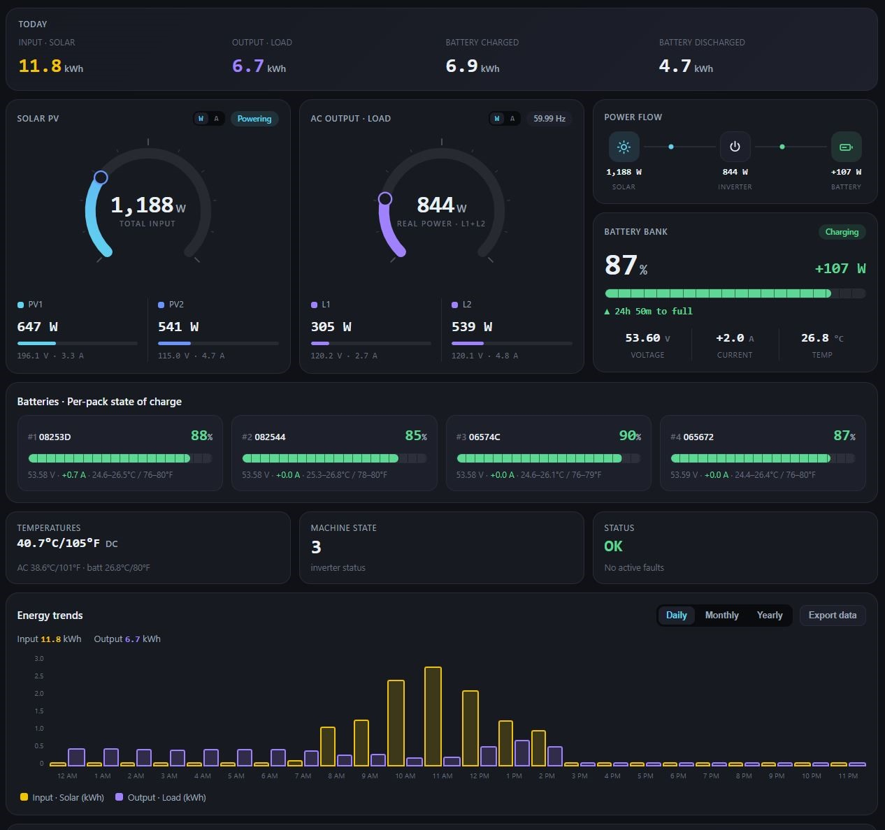
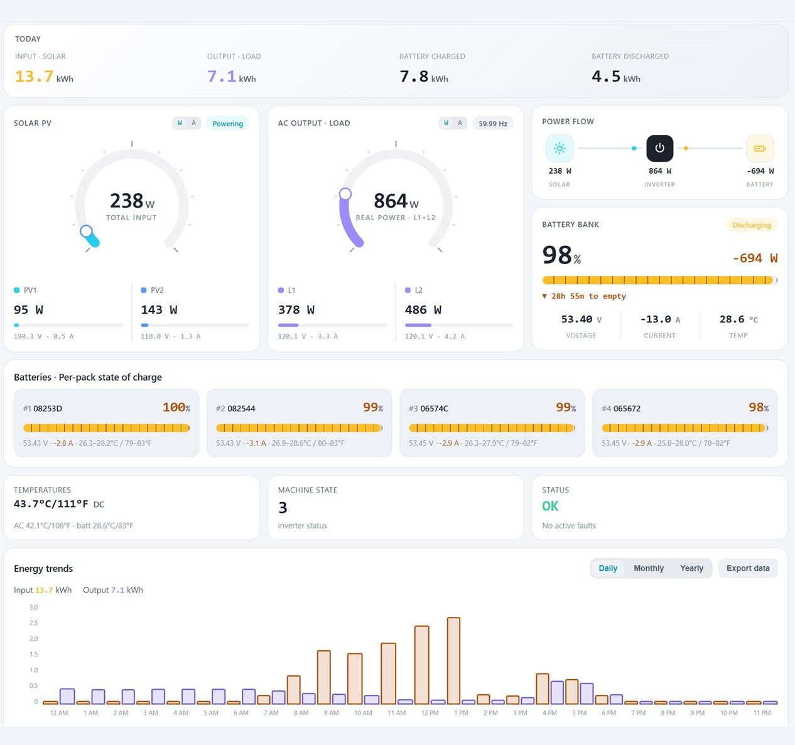
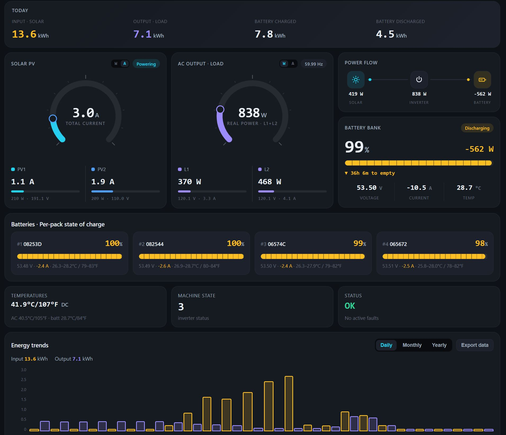
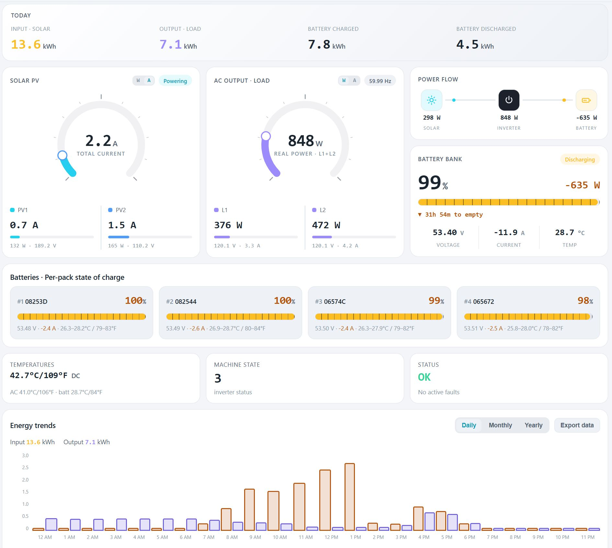
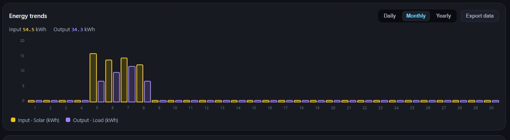
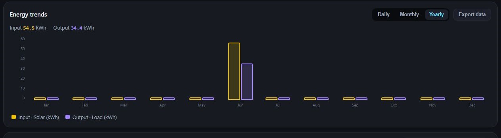
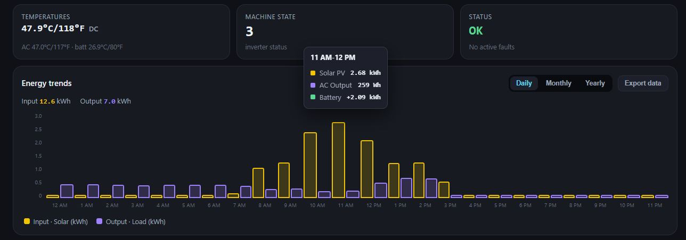
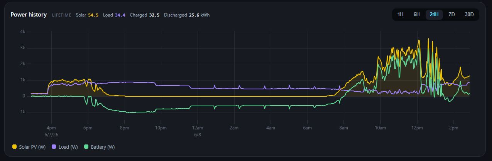
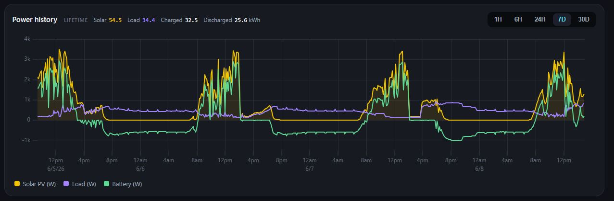

# Solar Tracking Dashboard

A self-hosted dashboard for an SRNE / Eco-Worthy hybrid solar inverter and JBD
battery BMS, running headless on a **Raspberry Pi Zero 2 W**. It polls live
telemetry, stores a time-series history (which the companion Android app never
kept), and serves current + historical charts over the local network.

The protocol layer is a faithful Python port of the companion "Private Solar
Monitoring" Android app, validated byte-for-byte against the same reference
vectors.

## Screenshots

The dashboard has a light and a dark theme.

| Dark | Light |
|------|-------|
|  |  |

The same view with the wheels switched to amps:

| Dark · amps | Light · amps |
|-------------|--------------|
|  |  |

At a glance: PV / load radial wheels, a power-flow diagram, the battery bank with
per-pack state of charge (four ECO-LFP48100 packs here), live temperatures, fault
status, an energy-trends chart with CSV export, and a rolling power-history graph.

### Energy trends — daily, monthly, yearly

The energy-trends chart rolls input vs. output up by hour, day, or month; hover any
bar for the exact Solar PV / AC Output / Battery split. These two also show the
**AC Input · Grid/Gen** wheel, which appears when grid or generator power is wired in.

| Monthly | Yearly |
|---------|--------|
|  |  |



### Power history

A rolling line chart of Solar / Load / Battery power, zoomable from the last hour out
to 30 days (1H · 6H · 24H · 7D · 30D), reconstructed from the SQLite time-series store.

| Last 24 hours | Last 7 days |
|---------------|-------------|
|  |  |

## Data sources

| Source | Transport | Status |
|--------|-----------|--------|
| SRNE/Eco-Worthy inverter | TCP 8899 (Solarman V5 + Modbus-RTU) | **live** |
| JBD BMS (per-cell battery) | BLE (svc 0xFF00 / notify 0xFF01) | **live** |

The inverter also reports battery SOC / voltage / current / temp, so the inverter
feed alone covers the core picture; BLE adds per-cell granularity.

## Layout

```
solardash/
  codec.py      CRC-16/Modbus, Modbus-RTU (fn 0x03), Solarman V5 framing
  inverter.py   SRNE register map + decode (InverterStatus)
  client.py     async TCP poller for the Solarman dongle
  jbd.py        JBD BMS frame parser (0x03 basic info + 0x04 cells)
  bms_client.py / bms_poller.py   BLE poller for the battery packs
  db.py         SQLite time-series store
  poller.py     periodic poll -> store loop
  api.py        JSON payload builders (unit-tested)
  server.py     FastAPI: JSON API + serves the dashboard
  cli.py        `solar` — terminal status view (for the remote shell)
  config.py     env-var configuration
  web/          static dashboard (uPlot, styled to the app)
sim/            offline inverter simulator (replays captured frames)
tests/          protocol tests pinned to real reference vectors
```

## Tests

Pure-stdlib, no installs needed:

```
python tests/test_codec.py
```

## Setting up a Raspberry Pi Zero 2 W from scratch

This is the whole path from a blank microSD to a headless dashboard that auto-starts
on boot and is reachable from anywhere via Raspberry Pi Connect. It targets a
**Pi Zero 2 W**, but any Pi with Wi-Fi + Bluetooth works.

You'll need: a Pi Zero 2 W, a microSD card (8 GB+), a 5 V power supply, and the
[Raspberry Pi Imager](https://www.raspberrypi.com/software/) on your computer.

### 1. Flash the OS (headless)

In Raspberry Pi Imager:

1. **Device:** Raspberry Pi Zero 2 W
2. **OS:** Raspberry Pi OS Lite (64-bit) — under *Raspberry Pi OS (other)*. No
   desktop is needed; this runs headless.
3. **Storage:** your microSD card.
4. Click **Next → Edit Settings** and fill in the OS-customisation so the Pi comes
   up on the network with no monitor/keyboard:
   - **Hostname:** `solarpi` (so it answers at `solarpi.local`).
   - **Username / password:** e.g. `myusername` (the `deploy.ps1` default assumes
     this user — change both to match if you pick another).
   - **Wi-Fi:** SSID, password, and your **Wi-Fi country** (required, or the radio
     stays off).
   - **Locale:** your timezone and keyboard layout.
   - On the **Services** tab: **Enable SSH** → *Use password authentication* (or
     paste a public key for passwordless login, which `deploy.ps1` needs).
5. **Save → Write.** When it finishes, put the card in the Pi and power it from the
   **PWR** micro-USB port. First boot takes a minute or two.

### 2. Find it and log in

The Pi joins your Wi-Fi and advertises itself over mDNS:

```
ssh myusername@solarpi.local
```

If `.local` doesn't resolve (some networks block mDNS), find its IP in your
router's client list and `ssh myusername@<ip>` instead. Then update everything:

```
sudo apt update && sudo apt full-upgrade -y
sudo reboot
```

### 3. Raspberry Pi Connect (remote access from anywhere)

[Raspberry Pi Connect](https://www.raspberrypi.com/documentation/services/connect.html)
gives you a remote shell (and screen sharing on desktop builds) from
`connect.raspberrypi.com` — no port-forwarding, works from outside your LAN.

```
sudo apt install -y rpi-connect-lite      # 'lite' = headless: remote shell only
loginctl enable-linger                    # let it run without an active login
rpi-connect on
rpi-connect signin                        # prints a URL — open it, sign in, done
```

Check status with `rpi-connect status`. From then on the Pi shows up at
[connect.raspberrypi.com](https://connect.raspberrypi.com), and you can open a shell
to it from any browser. `solar` and `solar watch` (below) are handy in that shell.

### 4. Install the dashboard

```
sudo apt install -y git python3-venv python3-full bluetooth bluez
git clone https://github.com/mydataismydata/solarpi.git ~/solardash
cd ~/solardash
python3 -m venv .venv
.venv/bin/pip install -r requirements.txt
# Battery over BLE also needs bleak:
.venv/bin/pip install bleak
```

(Run `deploy/diag.sh` if you want to sanity-check sudo / venv / pip / PyPI reachability
on a fresh Pi.)

### 5. Configure your install

Create `~/solardash/solardash.env` with your site's details. Everything has a sane
default (see `solardash/config.py`); a real deployment usually sets:

```ini
# Inverter — the Solarman Wi-Fi dongle on the SRNE/Eco-Worthy inverter
SOLAR_INVERTER_IP=192.168.#.#
SOLAR_INVERTER_SERIAL=1234567890     # the serial printed on the dongle
SOLAR_POLL_INTERVAL=10

# Battery packs (JBD BMS over BLE) — comma-separated MACs, optional =name.
# Find the MACs with: deploy/ble_probe.py
SOLAR_BMS_ADDRESSES=AA:BB:CC:DD:EE:01,AA:BB:CC:DD:EE:02
# Each pack's fixed parallel position (#N from the phone app) — MAC=pos,...
SOLAR_BMS_POSITIONS=AA:BB:CC:DD:EE:01=1,AA:BB:CC:DD:EE:02=2
```

The database is created automatically at `~/solardash/data/solar.sqlite`.

### 6. Auto-start on boot (systemd user service)

Run the dashboard as a **user** service so it owns the BLE session bus, and turn on
*linger* so it starts at boot without anyone logged in.

```
mkdir -p ~/.config/systemd/user
```

Create `~/.config/systemd/user/solardash.service`:

```ini
[Unit]
Description=Solar Tracking Dashboard
After=network-online.target
Wants=network-online.target

[Service]
WorkingDirectory=%h/solardash
EnvironmentFile=%h/solardash/solardash.env
ExecStart=%h/solardash/.venv/bin/uvicorn solardash.server:app --host 0.0.0.0 --port 8000
Restart=always
RestartSec=5

[Install]
WantedBy=default.target
```

Enable it (and lingering, if you didn't already in step 3):

```
loginctl enable-linger
systemctl --user daemon-reload
systemctl --user enable --now solardash
```

The dashboard is now live at **http://solarpi.local:8000** on your LAN.

#### Bluetooth at boot (for the BLE battery)

BlueZ can come up soft-blocked, which the user service can't fix on its own. Add a
tiny system service that unblocks it once at boot:

`/etc/systemd/system/bt-unblock.service`:

```ini
[Unit]
Description=Unblock Bluetooth at boot
After=systemd-rfkill.service

[Service]
Type=oneshot
ExecStart=/usr/sbin/rfkill unblock bluetooth

[Install]
WantedBy=multi-user.target
```

```
sudo systemctl enable --now bt-unblock
```

#### Optional: demo with the simulator

To see the dashboard with synthetic data (no inverter on the network), run the
offline simulator and point the dashboard at it. Either run
`python sim/inverter_sim.py` in a second shell, or wrap it in a
`solardash-sim.service` user unit. With `SOLAR_INVERTER_IP=127.0.0.1` (the default),
the dashboard reads the sim. **Disable it before going on-site** — see below.

## Service management (on the Pi)

```
systemctl --user status solardash           # health
journalctl --user -u solardash -f           # live logs
systemctl --user restart solardash          # restart after editing solardash.env
```

### Going on-site (real inverter)
1. Edit `~/solardash/solardash.env`: set `SOLAR_INVERTER_IP`, `SOLAR_INVERTER_SERIAL`
   (printed on the Solarman dongle), and `SOLAR_POLL_INTERVAL` (e.g. 10).
2. Disable the simulator: `systemctl --user disable --now solardash-sim`
3. `systemctl --user restart solardash`

### Deploying updates from your computer
`deploy.ps1` (Windows/PowerShell) pushes local commits to GitHub, then SSHes into the
Pi to `git pull` and restart the service:

```powershell
.\deploy.ps1                              # default host: antarctica@solarpi
.\deploy.ps1 -PiHost yourusername@192.168.#.#
.\deploy.ps1 -Pip                         # also pip install (when requirements.txt changed)
```

It needs passwordless (key-based) SSH to the Pi — the same key you can paste during
imaging in step 1.

## Android app integration (mDNS)

The Private Solar Monitoring Android app can read battery + inverter data straight from this Pi
over `GET /api/battery` and `GET /api/current`, instead of connecting to the batteries over
Bluetooth itself. That matters because the JBD packs allow only one BLE connection at a time — when
the Pi is polling them, the phone can't, and vice-versa. With this Pi on the network the app pulls
from it automatically and leaves the BLE link to the Pi.

Discovery uses mDNS: `server.py` advertises a `_solarpi._tcp` service (port from `SOLAR_HTTP_PORT`,
default 8000) via the `zeroconf` package. It's best-effort — if `zeroconf` isn't installed the
dashboard still serves; the app then falls back to a manually-entered host in its Discover tab.

If you'd rather advertise via the Pi's own avahi-daemon (no Python dependency), drop this in
`/etc/avahi/services/solarpi.service` and `sudo systemctl restart avahi-daemon`:

```xml
<?xml version="1.0" standalone='no'?>
<!DOCTYPE service-group SYSTEM "avahi-service.dtd">
<service-group>
  <name replace-wildcards="yes">Solar Pi on %h</name>
  <service>
    <type>_solarpi._tcp</type>
    <port>8000</port>
  </service>
</service-group>
```
